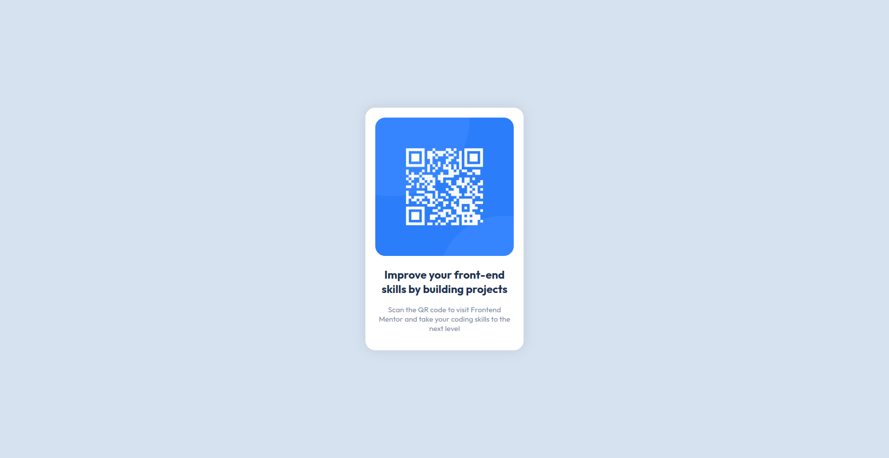

# Frontend Mentor - QR code component solution

This is a solution to the [QR code component challenge on Frontend Mentor](https://www.frontendmentor.io/challenges/qr-code-component-iux_sIO_H). Frontend Mentor challenges help you improve your coding skills by building realistic projects. 

## Overview

### Screenshot



### Links

- Solution URL: (https://www.frontendmentor.io/solutions/qr-code-component-html-and-css-QAJwTf9VHl)
- Live Site URL: (https://frontend-challenge-qrcode-component.vercel.app)


### Built with

- Semantic HTML5 markup
- CSS custom properties
- Flexbox

### What I learned

Useful Code Samples:

```css
.proud-of-this-css {
  min-height: 100vh;
  display: flex;
  justify-content: center;
  align-items: center;
  border-radius: 1rem;
  font-weight: 700;
  margin: 0;
  padding: 0;
  box-shadow: 0 0 25px rgba(0,0,0,0.05);
}

@media only screen and (max-width: 375px) {
    .container {
        max-width: 100%;
    }
}
```

### Continued development

I want to improve my HTML divisions and CSS Flexbox!

### Useful resources

- (https://stackoverflow.com/questions/8473162/how-do-i-set-height-of-container-div-to-100-of-window-height) - This helped me centralize it.
- (https://github.com/IgorDGomes/FM-QR-Code-Component-Main/blob/main/style.css) - This GitHub Solution helped me a lot!
- (https://www.youtube.com/@KevinPowell) and (https://www.youtube.com/@MrCoderYt) - These channels helped me a ton!

## Acknowledgments

Here to Thanks (https://github.com/IgorDGomes/) for the code samples, and (https://www.frontendmentor.io/profile/Tactenator) for the feedback.